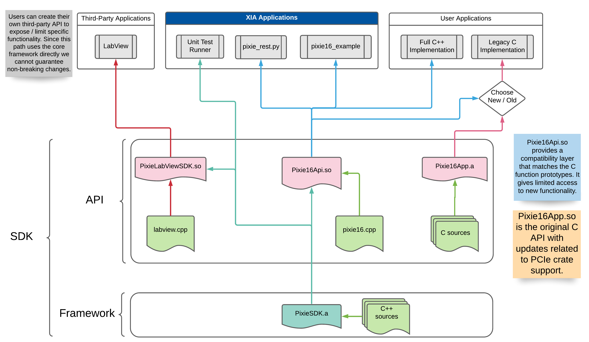

# PixieSDK

The PixieSDK is a fully featured, cross-platform, C++ based software development kit for XIA LLC's
Pixie-16 product line. We've tried to provide all the tools necessary to get a fresh system
up-and-running without the user writing a single line of code.

## Quick Links

* [Installation](doc/pages/installation.md)
* [Example Programs](examples/README.md)
* [Project Glossary](doc/pages/glossary.md)
* [FAQ](doc/pages/faq.md)
* Legacy API
    * [Architecture](doc/pages/pixie16/legacy/legacy-api-architecture.md)
    * [Usage Overview](doc/pages/pixie16/legacy/legacy-overview.md)
* [API Transition Guide](doc/pages/pixie16/pixiesdk-transition-guide.md)

## API Update Policy

By necessity, we will be making changes to the public API calls and the SDK. We will adopt a process
of depreciating interfaces then removing them. We will provide notice of

* no less than 12 months before removing an interface,
* and no less than 6 months before changing an interface.

Notices will appear in the source code, documentation, and release notes. We will notify users via
email 30 days prior to the deprecation date.

Deprecated interfaces will receive bug fixes during their deprecation phase, but will receive no
added functionality. This policy may not cover all situations, and will evolve over time. For
situations that don’t fit neatly into this policy, we will ensure that the information is available
in all relevant Release Notes.

### Notice regarding Legacy C API

The Legacy C API is now deprecated and will no longer receive support outside critical bug fixes.
**We will remove the legacy C API on July 31, 2023**.

We provide
a [basic guide on how to transition to the new API](doc/pages/pixie16/pixiesdk-transition-guide.md)
within the documentation.

## Feature highlights

* System no longer locks up when attempting to access the modules concurrently.
* Host-side list-mode data buffering prevents data loss from full list-mode data FIFOs.
* JSON settings files contain metadata regarding the module's configuration and firmware as well as
  DSP variables.
* Firmware loads in parallel. A full crate takes about 3 seconds to boot.
* Optimized wait times reduces the time spent waiting on the hardware.
* Removed the need for `pxisys.ini`.

## Tested Systems

| Operating System | CMake Version | Compiler | Compiler Version |
|---|---|---|---|
| Windows 10 | 3.20.2 | MSVC | 14.28.29333 |
| CentOS 8 | 3.11.4 | GCC | 8.3.1 |

## Dependencies and Prerequisites

* Compiler supporting the C++ 14 standard
* Cmake 3.10+
* [Broadcom PCI/PCIe SDK 8.00+](https://github.com/xiallc/broadcom_pci_pcie_sdk)
    * You should have `PLX_SDK_DIR` exported in your environment before building.

> **Note**: The Legacy code can be used with much older compilers (ex. GCC 4.5+) and older versions
> of the Broadcom PCI/PCIe SDK (ex. 7.11). You'll still need CMake 3.10+ to generate the build files.

## Library Architecture

## Copyright

Copyright (c) 2005 - 2021, XIA LLC All rights reserved.
