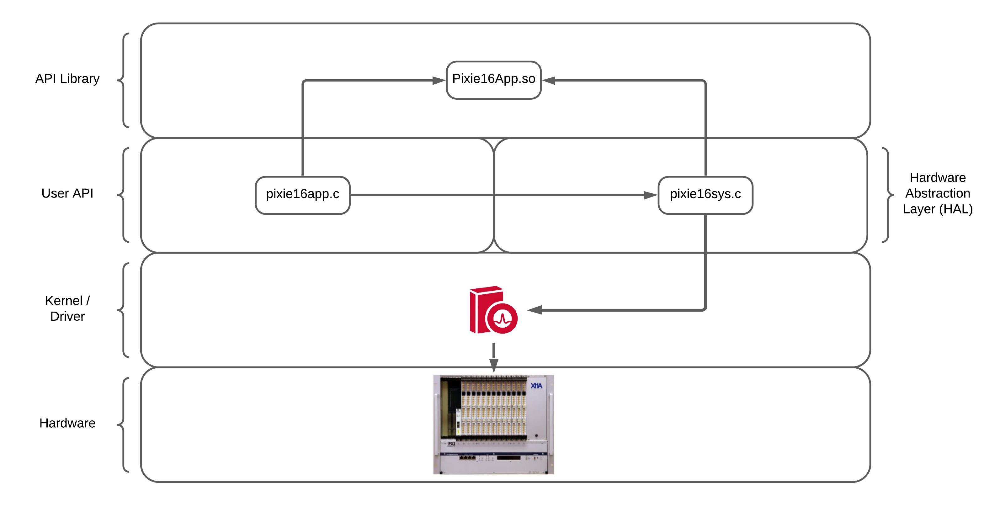

# Legacy API Architecture

The Pixie-16 API consists of two libraries: Application Library and System Library. Each library
performs different functionality, is standalone, and can be compiled separately. The following
drawing illustrates the basic architecture of the Pixie-16 API.

The Application Library consists of C functions that translate user parameters into DSP parameters
and control the operation of Pixie-16 modules. They call functions in the System Library to
communicate to the Pixie-16 module. Since the Pixie-16 is an all-digital signal processing module
whose operation is controlled by parameters in digital forms (e.g. filter length in multiples of 10
ns ADC sampling rate), there are functions in the Application Library that convert parameters from
physical units (e.g. μs, volts, etc.) into digital formats that can be understood by the Pixie-16
modules. Other Application Library functions configure Pixie-16 modules, make MCA or list mode runs
and retrieve data from the Pixie- 16 modules.

Functions in the System Library communicate directly to the Pixie-16 hardware through the PCI bus (
32-bit, 33 MHz) and the PCI 9054 I/O Accelerator from PLX Technology Inc. (PLX Technology, Inc. is
now part of Broadcom Inc.) PLX PCI 9054 is a 32-bit PCI bus mastering interface chip that on one
side connects to the Pixie-16 FPGAs through the local bus, and on the other side connects to the
host computer through the 32-bit PCI bus. PLX provides a Software Development Kit (SDK) for users to
develop their own software utilizing PLX API functions. The Pixie-16 System Library is built upon
the PLX API functions to communicate to the Pixie-16 modules.