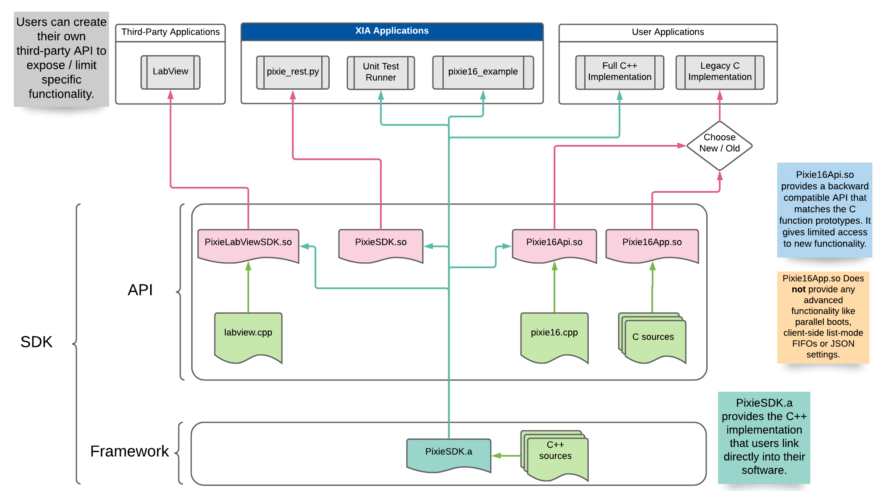

# PixieSDK

The PixieSDK is a fully featured, cross-platform, C++ based software development kit for XIA LLC's
Pixie-16 product line. We've tried to provide all the tools necessary to get a fresh system
up-and-running without the user writing a single line of code.

##### Notice regarding Legacy C API

The Legacy C API is now deprecated and will no longer receive support outside critical bug fixes. To
minimize the impact we encourage all users to migrate to the backward compatible Pixie16Api library.
**We will remove the legacy C API on July 31, 2023**.

## Quick Links

* [Installation](doc/pages/installation.md)
* [Example Programs](examples/README.md)
* [Project Glossary](doc/pages/glossary.md)
* Legacy API
    * [Architecture](doc/pages/pixie16/legacy/legacy-api-architecture.md)
    * [Usage Overview](doc/pages/pixie16/legacy/legacy-overview.md)

## Feature highlights

* System no longer locks up when attempting to access the modules concurrently.
* Host-side list-mode data buffering prevents data loss from full list-mode data FIFOs.
* JSON settings files contain metadata regarding the module's configuration and firmware as well as
  DSP variables.
* Firmware loads in parallel. A full crate takes about 3 seconds to boot.
* Optimized wait times reduces the time spent waiting on the hardware.
* Removed the need for `pxisys.ini`.

## Tested Systems

| Operating System | CMake Version | Compiler | Compiler Version |
|---|---|---|---|
| Windows 10 | 3.20.2 | MSVC | 14.28.29333 |
| Ubuntu 20.04 | 3.16.3 | GCC | 9.3.0 |
| CentOS 8 | 3.11.4 | GCC | 8.3.1 |

## Dependencies and Prerequisites

* Compiler supporting the C++ 14 standard
* Cmake 3.10+
* [Broadcom PCI/PCIe SDK 8.00+](https://github.com/xiallc/broadcom_pci_pcie_sdk)
    * You should have `PLX_SDK_DIR` exported in your environment before building.

> **Note**: The Legacy code can be used with much older compilers (ex. GCC 4.5+) and older versions
> of the Broadcom PCI/PCIe SDK (ex. 7.11). You'll still need CMake 3.10+ to generate the build files.

## Library Architecture

## Copyright

Copyright (c) 2005 - 2021, XIA LLC All rights reserved.
