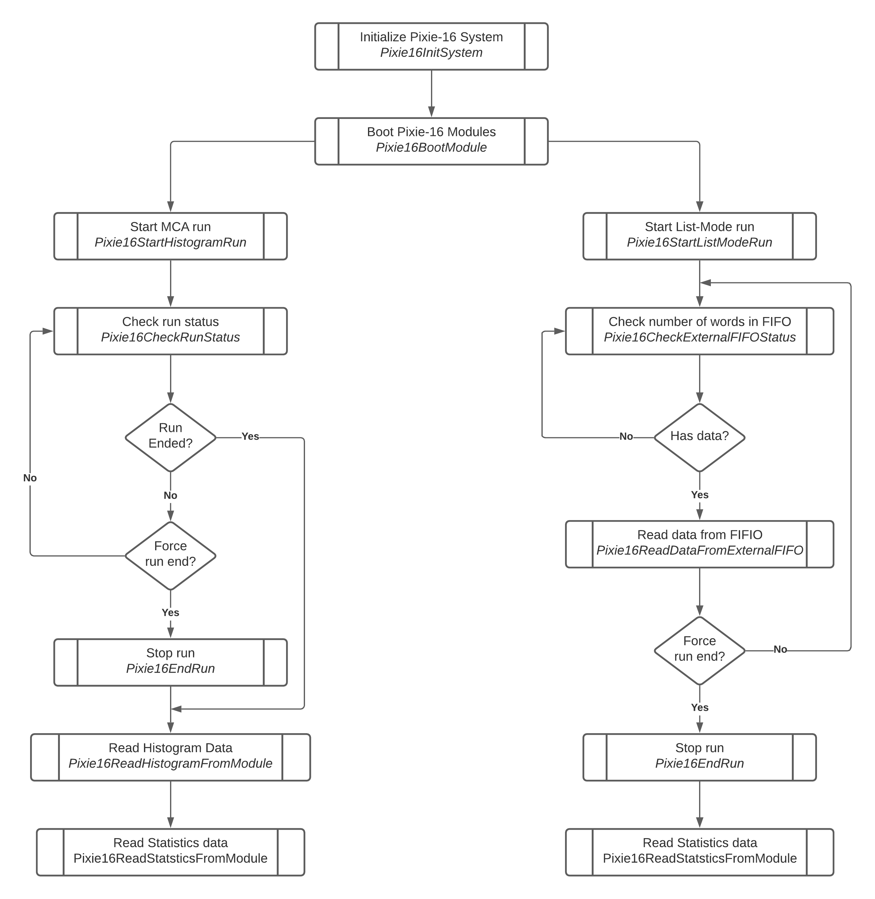

# Legacy API Usage Overview

In order to better illustrate the usage of the functions in the Pixie-16 API, an overview of the
operation of Pixie-16 is given below and the usage of the API functions is mentioned wherever
appropriate.

At first the system needs to be initialized. This is a process in which the Pixie-16 modules are
made known to the system and are “opened” for communication via the PCI interface. The function
`Pixie16InitSystem` is used to achieve this. This has to be done once after the embedded computer,
or desktop computer if using a PCI bridge, has booted.

The second step is to boot the Pixie-16 modules. It involves downloading all FPGA configurations and
booting the digital signal processor (DSP). It concludes with downloading all DSP parameters (the
instrument settings) and commanding the DSP to program the FPGAs and the on-board digital to analog
converters (DAC). All this has been encapsulated in a single function `Pixie16BootModule`. However,
if the module information is unknown to the user, function `Pixie16ReadModuleInfo` should be called
first to retrieve variant information of the module so that appropriate firmware, DSP and
configuration parameters files can be chosen for the module prior to calling
function `Pixie16BootModule`.

Now, the instrument is ready for data acquisition. An important mode of operation is MCA histogram
run which can be used for diagnostic and calibration purposes. The system can be programmed to
acquire independent or coincident energy histograms, or spectra, on each channel. The function to
start a histogram run is `Pixie16StartHistogramRun`. MCA runs can time out by themselves when the
elapsed run time reaches the preset run time, or the user can end them prematurely by using
`Pixie16EndRun`, which can also be used to prematurely end list mode runs as well. Afterwards,
histogram and statistics data are available for read out by the host computer (histograms can also
be read out while the run is in progress) using functions `Pixie16ReadHistogramFromModule` and
`Pixie16ReadStatisticsFromModule`. If the MCA run is set to time out by itself, users can call the
function `Pixie16CheckRunStatus` to see whether the MCA run is still ongoing or has finished.

Normal operation of the instrument is to start the list mode data acquisition run using the NEW_RUN
mode to erase any old histograms and statistics information by using function
`Pixie16StartListModeRun`. The host computer will poll the status of the external FIFO by using
function `Pixie16CheckExternalFIFOStatus`, and if the status indicates there is data in the FIFO,
functions `Pixie16ReadExternalFIFO` or `Pixie16SaveExternalFIFODataToFile` can be used to read data
from the external FIFO and save the data to a file on the local hard drives. List mode runs can be
stopped by calling function `Pixie16EndRun`. After the list mode run ends, histogram and statistics
data are available for read out by the host computer just as in the case of an MCA mode run.

From the statistics data, users can compute useful quantities like real time, total number of
processed events, live time, input count rate, and output count rate by using the functions
`Pixie16ComputeRealTime`,`Pixie16ComputeProcessedEvents`, `Pixie16ComputeLiveTime`
,`Pixie16ComputeInputCountRate`, `Pixie16ComputeOutputCountRate`, respectively.

The following diagram illustrates the sequences for operating the Pixie-16 modules.

